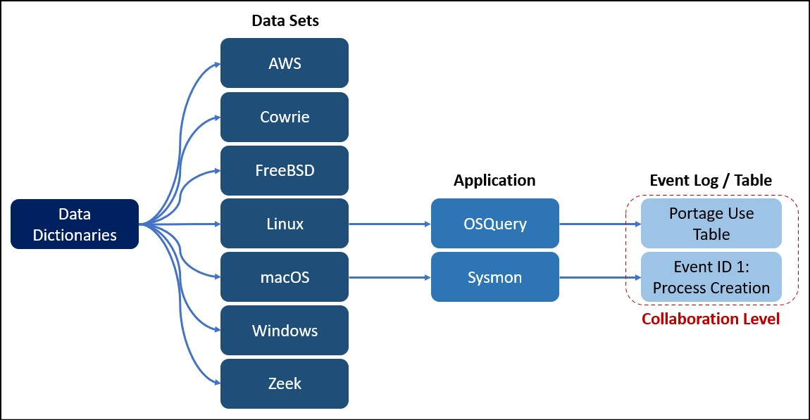

# OSSEM Data Dictionaries (OSSEM-DD)

## Description
This part of the OSSEM project contains specific information about several security event logs organized by operating system and their respective data sets. Each dictionary describes a single event log and its corresponding event field names. The difference between the ../common_information_model/ folder and the data dictionaries is that in the CIM the field definitions are more general whereas in a data dictionary, each field name definition is unique to the specific event log.

## Data Sets
|Data Set|Description|
|---|---|
|[Amazon Web Services](aws/)|Data dictionaries for AWS DataSources.|
|[Cowrie](cowrie/)|Data dictionaries for Cowrie Honeypot events.|
|[FreeBSD](freebsd/)|Data dictionaries for FreeBSD based events.|
|[Linux](linux/)|Data dictionaries for Linux based events.|
|[macOS](macos/)|Data dictionaries for macOS based events.|
|[Windows](windows/)|Data dictionaries for Windows based events.|
|[Zeek](zeek/)|Zeek provides event logs with network metadata on over 40+ different applications and protocols.|

## How To Contribute?
### a) Level of Detail
Contributing to the Data Dictionaries piece of OSSEM implies the creation and/or modification of a file containing a description for all data fields of a specific **event log** or **table** that is generated by a tool or application in one or more operating systems.



### b) Files Format
Every security event log or table will be stored in **yaml** format using the **.yml** extension.
### c) Yaml File Structure
Each yaml file should contain the following components:

|Component|Description|
|---|---|
|title|Short description of the event log or table.|
|description|Detailed description of the event log or table.|
|platform|Platform where the event log or table can be collected from.|
|log_source|Tool or application used to collect the event log or table.|
|event_code|Code or name that makes reference to the event log or table.|
|event_version|Version of the event log or table.|
|event_fields|List of all data fields provided by the log_source. For each data field, we must consider the following sub-components: name, type of data, description, and a sample value.|
|references|List of references that supported the documentation of the event log or table. For each reference we must consider the following components: text and link.|
|tags|Special words that can facilitate the search and aggregation of event logs or tables.|

Here is an example of the content of a Yaml file for the first event log provided by Sysmon for Windows platform systems.

```yaml
title: 'Event ID 1: Process creation'
description: The process creation event provides extended information about a newly created process. The full command line provides context on the process execution. The ProcessGUID field is a unique value for this process across a domain to make event correlation easier. The hash is a full hash of the file with the algorithms in the HashType field.
platform: windows
log_source: sysmon
event_code: '1'
event_version: '4.32'
event_fields:
- name: ProcessId
  type: integer
  description: Process ID used by the os to identify the created process (child)
  sample_value: '4756'
- name: Image
  type: string
  description: File path of the process being spawned/created. Considered also the child or source process.
  sample_value: C:\Windows\System32\conhost.exe
references:
- text: Sysmon Source
  link: https://docs.microsoft.com/en-us/sysinternals/downloads/sysmon#event-id-1-process-creation
tags: []
```

### d) A Step by Step Guide
For a step by step guide on how to contribute a Data Dictionary to OSSEM, please refer to this [blogpost]().